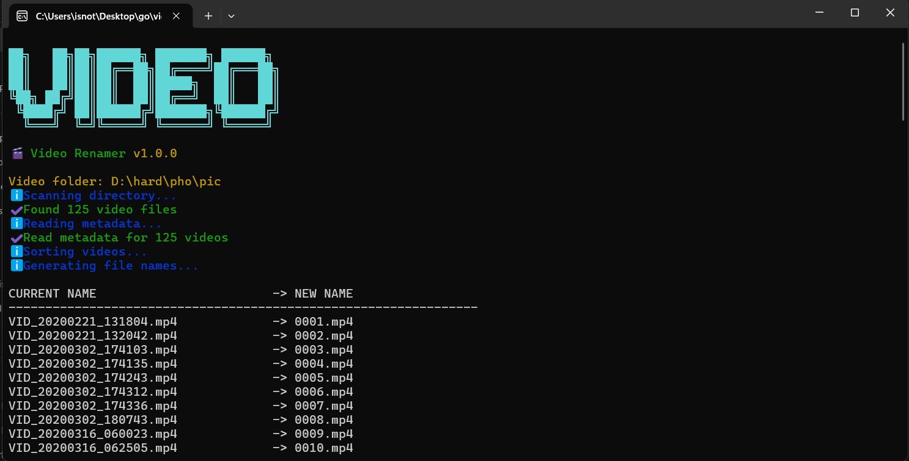

# 🎬 Video Renamer

A fast Go CLI that renames videos using their **actual capture date** extracted from **ExifTool metadata**, not filenames or file modification dates.

<p align="center">
  
</p>


```text
VID_8452.mp4  →  0001.mp4
VID_8453.mp4  →  0002.mp4
VID_8454.mp4  →  0003.mp4
```

## Features

- Read video timestamps using ExifTool
- Batch metadata extraction
- Chronological sorting
- Sequential renaming (`0001.mp4`, `0002.mp4`, ...)
- Dry-run preview
- Safe two-phase renaming
- Cross-platform (Windows, Linux, macOS)

## Requirements

Install **ExifTool** and make sure it's available in your `PATH`.

Verify installation:

```bash
exiftool -ver
```

Download: https://exiftool.org

## Installation

Clone the repository:

```bash
git clone https://github.com/isnot00/video-renamer.git
cd video-renamer
```

Build:

```bash
go build -o video-renamer ./cmd
```

## Usage

Preview changes:

```bash
video-renamer --dir ./videos --dry-run
```

Rename files:

```bash
video-renamer --dir ./videos
```
## Build

Build the current platform:

```bash
make build
```

Build for Windows:

```bash
make windows
```

Build for Linux:

```bash
make linux
```

Build all targets:

```bash
make release
```
